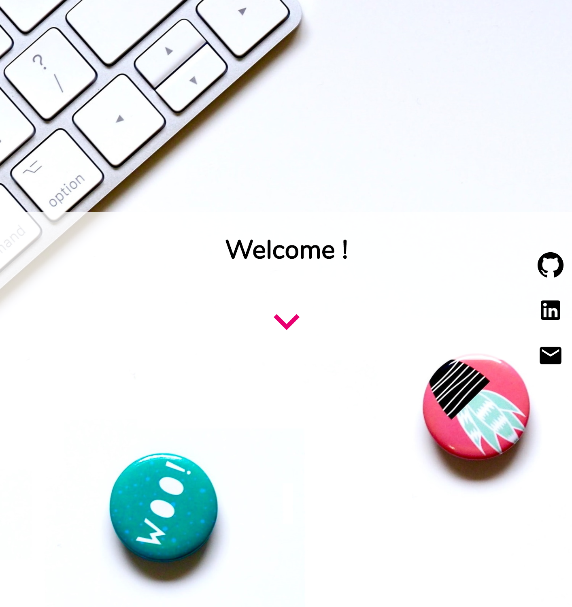

# Portfolio

## About The Project

Portfolio is a web page to display contact details and portfolio projects 
  
It is developed to demonstrate:
 * Developing a simple React application
 * Displaying items using static data,
 * Displaying data with Material UI
 
### Features
* Reads the data from a file
* Lists projects
* Opens project links
* Uses scroll animation

### Built With
* React
* Javascript
* Material UI

## Getting Started

To get a local copy up and running please install these:
 

    yarn add @material-ui/core
    yarn add @material-ui/icons
    npm i react-scroll
